# Project File Structure

This document defines the folder hierarchy and responsibilities. Agents must read this before creating folders or moving files.

## Directory Structure

```mermaid
graph TD
    Root[Project Root]
    
    Root --> ProjectBrief[projectbrief.md]
    Root --> Architecture[ARCHITECT_IMPLEMENTATION.md]
    Root --> Agents[AGENTS.md]
    Root --> FileStructure[FILE_STRUCTURE.md]
    Root --> Changelog[CHANGELOG.md]
    
    Root --> Apps[apps/]
    Root --> Packages[packages/]
    Root --> Docs[docs/]
    Root --> Scripts[scripts/]
    Root --> Tools[tools/]
    Root --> Prompts[prompts/]
    Root --> Changeset[.changeset/]
    
    Apps --> AppsWebArcade[web-arcade/]
    Apps --> AppsApi[api/]
    Apps --> AppsDesktop[desktop-tauri/]
    Apps --> AppsMobile[mobile-capacitor/]
    Apps --> AppsGamesBuild[games-build/]
    
    Packages --> ArcadeCore[arcade-core/]
    Packages --> XrplTokenUtils[xrpl-token-utils/]
    Packages --> SharedAnticheat[shared-anticheat/]
    Packages --> WalletClient[wallet-client/]
    Packages --> Tsconfig[tsconfig/]
    
    Docs --> DocsAdr[adr/ — Architecture Decision Records]
    Docs --> DocsComponents[components/]
    Docs --> DocsExplanation[explanation/]
    Docs --> DocsHowTo[how-to/]
    Docs --> DocsMarketing[marketing/]
    Docs --> DocsReference[reference/]
    Docs --> DocsRunbooks[runbooks/]
    Docs --> DocsTutorials[tutorials/]
    Docs --> DocsArchive[_archive/]
    Docs --> DocsAudit[audit-2026-06-07/]
```



> **Note:** This is a Turborepo monorepo. Each workspace (`apps/*`, `packages/*`) has its own
> `src/`, `tests/`, and `package.json`. The `src/`/`tests/` patterns apply inside individual
> workspaces, not at root. See `ARCHITECT_IMPLEMENTATION.md` for the full monorepo topology.

## Root-Level Files

| File | Responsibility |
|------|---------------|
| `projectbrief.md` | What we're building and why (business context) |
| `ARCHITECT_IMPLEMENTATION.md` | How the system is structured (technical design) |
| `AGENTS.md` | Operating instructions for AI agents |
| `FILE_STRUCTURE.md` | This file — folder hierarchy and rules |
| `CHANGELOG.md` | What changed and why (decision log) |
| `README.md` | Quick start guide for humans |
| `HERMES.md` | DevOps pipeline and agent configuration |
| `CONTRIBUTING.md` | Contribution guidelines |
| `CODE_OF_CONDUCT.md` | Community standards |
| `SECURITY.md` | Security policy and vulnerability reporting |
| `PROJECT_STATE.md` | Current project state snapshot |
| `.gitignore` | Files to exclude from version control |
| `.env.example` | Environment variable template (never commit `.env`) |
| `package.json` | Root workspace dependencies and scripts |
| `pnpm-workspace.yaml` | pnpm monorepo workspace configuration |
| `turbo.json` | Turborepo pipeline configuration |
| `railway.toml` | Railway deployment configuration |
| `.nvmrc` | Node.js version pinning |

## Folder Responsibilities

### `apps/` (Deployable Applications)

**Purpose:** Contains the deployable applications in the monorepo.

- **`apps/web-arcade/`** — The Next.js 15 browser arcade frontend. Handles UI, game rendering, and wallet connection.
- **`apps/api/`** — The Express/Node backend. Handles session management, game state, anti-cheat logic, and database operations.
- **`apps/desktop-tauri/`** — Tauri-based desktop application wrapper.
- **`apps/mobile-capacitor/`** — Capacitor-based mobile application wrapper.
- **`apps/games-build/`** — Standalone game build pipeline and asset compilation.

**Rules:**
- Each app has its own `package.json`, `tsconfig.json`, and `src/` directory.
- Never import directly between apps — use shared packages instead.

### `packages/` (Shared Libraries)

**Purpose:** Shared libraries consumed by apps and other packages.

- **`packages/arcade-core/`** — Shared game logic, state machines, validation schemas (Zod), and global constants.
- **`packages/xrpl-token-utils/`** — All XRP Ledger interactions. Wallet generation, transaction signing, $NUT token logic, and payout execution.
- **`packages/shared-anticheat/`** — Shared anti-cheat logic and validation utilities used across apps.
- **`packages/wallet-client/`** — Client-side wallet connection and transaction management utilities.
- **`packages/tsconfig/`** — Shared TypeScript configurations.

**Rules:**
- Packages must be self-contained with their own `package.json`.
- No circular dependencies between packages.

### `docs/` (Documentation)

**Purpose:** Extended documentation beyond root-level files.

- **`docs/adr/`** — Architecture Decision Records (ADRs). Required for all Red Zone modifications.
- **`docs/components/`** — Component documentation and usage guides.
- **`docs/explanation/`** — Conceptual explanations and architectural deep-dives.
- **`docs/how-to/`** — Step-by-step how-to guides.
- **`docs/marketing/`** — Marketing materials and copy.
- **`docs/reference/`** — Reference documentation (APIs, schemas, configs).
- **`docs/runbooks/`** — Operational runbooks for deployment and incident response.
- **`docs/tutorials/`** — Onboarding and learning tutorials.
- **`docs/audit-2026-06-07/`** — Audit artifacts from the June 2026 review.
- **`docs/_archive/`** — Archived/deprecated documentation.

**Rules:**
- ADRs are mandatory for Red Zone changes (see `ARCHITECT_IMPLEMENTATION.md` §3).
- Update docs when APIs change significantly.

### `scripts/` (Automation and Tooling)

**Purpose:** Build, deployment, and development automation scripts.

- `check-score-caps-drift.js` — Score cap drift detection
- `fetch-assets.js` — Asset fetching utility
- `patch-auth-routes.js` — Auth route patching script
- `preflight.sh` — Pre-flight checks
- `verify-prod.sh` — Production verification
- `__tests__/` — Script tests

**Rules:**
- Keep scripts idempotent.
- Document script usage in comments.
- Use consistent naming: `verb-noun.sh`.

### `tools/` (Development Tools)

**Purpose:** Internal development tools and utilities.

- **`tools/scripts/`** — Miscellaneous dev scripts
- **`tools/thumbnails/`** — Thumbnail generation utilities
- **`tools/vps-account-server/`** — VPS account management server

### `prompts/` (AI Prompts)

**Purpose:** Stored prompts and templates for AI agent workflows.

- `resume-work.txt` — Session resume prompt

### `.changeset/` (Changesets)

**Purpose:** Changeset configuration for versioning and changelogs.

## Workspace-Internal Structure

Individual workspaces (`apps/*`, `packages/*`) follow this internal pattern:

```
workspace/
├── src/           # Source code
│   ├── modules/   # Feature modules and business logic
│   ├── utils/     # Shared utility functions
│   ├── types/     # TypeScript interfaces and type definitions
│   └── constants/ # Configuration constants
├── tests/         # Test code
│   ├── unit/      # Unit tests (mirror src/ structure)
│   ├── integration/ # Integration and e2e tests
│   └── fixtures/  # Test data and mocks
└── package.json   # Workspace dependencies
```

**Rules:**
- Test files end in `.test.ts` or `.spec.ts`.
- Mirror `src/` folder structure in `tests/`.
- Keep test data in `fixtures/`.
- No test files inside `src/`.

## Structure Rules for Agents

### Do:
- Follow the existing hierarchy
- Create subdirectories within defined folders
- Update this file when adding new top-level items
- Keep related files together

### Don't:
- Create new top-level folders without approval
- Scatter related files across multiple folders
- Add files to root unless they're project-wide docs
- Create deeply nested structures (max 3 levels)

## Adding New Structure

If you need a new folder:
1. Check if it fits in existing structure
2. If not, propose it with:
   - Name and purpose
   - Example contents
   - Why existing folders don't work
3. Update this file immediately
4. Add entry to CHANGELOG.md

## Maintenance

- Review this file monthly
- Remove empty folders (except those with `.gitkeep` scaffolding for future use)
- Consolidate scattered related files
- Keep Mermaid diagram current
