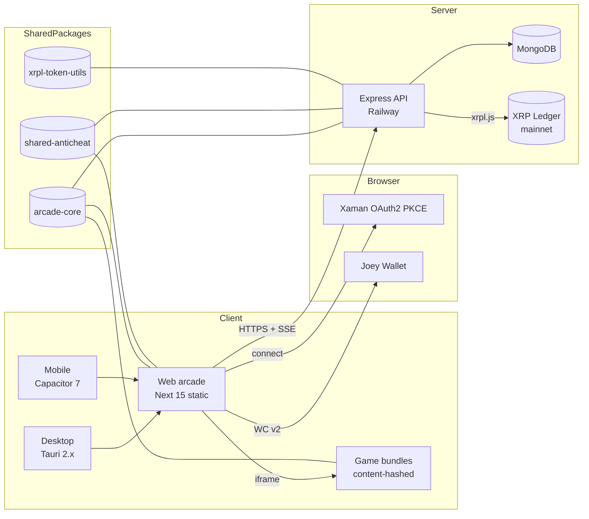

# Fuzzynuts

Free-to-play browser arcade on the XRP Ledger. Five HTML5 games, live
weekly leaderboards, real $NUT prize payouts.

- **Web**: <https://fuzzynuts.xyz> (Vercel, Next.js static export)
- **API**: <https://world.fuzzynuts.xyz> (Railway, Node/Express)
- **Token**: `NUT` issued by `rpL6HfoV578CAkZoNbm3UEK5BgVY9DxMP7`

## Quick start

```bash
git clone https://github.com/fuzzynutsxrp-ship-it/fuzzynuts.xyz.git
cd fuzzynuts.xyz
corepack enable && corepack prepare pnpm@9.15.0 --activate
pnpm install
cp apps/web-arcade/.env.example apps/web-arcade/.env.local
pnpm dev:web    # http://localhost:3000
pnpm dev:api    # http://localhost:4000
```

Full walkthrough: [docs/tutorials/01-run-the-arcade-locally.md](./docs/tutorials/01-run-the-arcade-locally.md).

## Architecture



## Repo layout

| Path | What |
|---|---|
| `apps/web-arcade` | Next.js 15 static export |
| `apps/api` | Express + Mongo, deployed to Railway |
| `apps/games-build` | One Vite pipeline for every iframe game |
| `apps/desktop-tauri` | Tauri 2.x shell |
| `apps/mobile-capacitor` | Capacitor 7 iOS + Android |
| `packages/arcade-core` | Single source of truth: SCORE_CAPS, slugs, schema |
| `packages/xrpl-token-utils` | XRPL client, verify, AMM price, payout |
| `packages/wallet-client` | Xaman + Joey adapters |
| `packages/shared-anticheat` | HMAC + nonce + session-token, shared web/api |
| `docs/` | Diátaxis: tutorials, how-to, reference, explanation, ADRs, runbooks |

## Contributing

See [CONTRIBUTING.md](./CONTRIBUTING.md). All security-relevant changes
follow [SECURITY.md](./SECURITY.md). AI agents working in this repo
must read [HERMES.md](./HERMES.md) first.

## License

[MIT](./LICENSE). Note: some game assets in `apps/games-build/games/`
originate from third parties and are tracked separately — see
[`docs/reference/third-party-assets.md`](./docs/reference/third-party-assets.md)
before redistribution.
